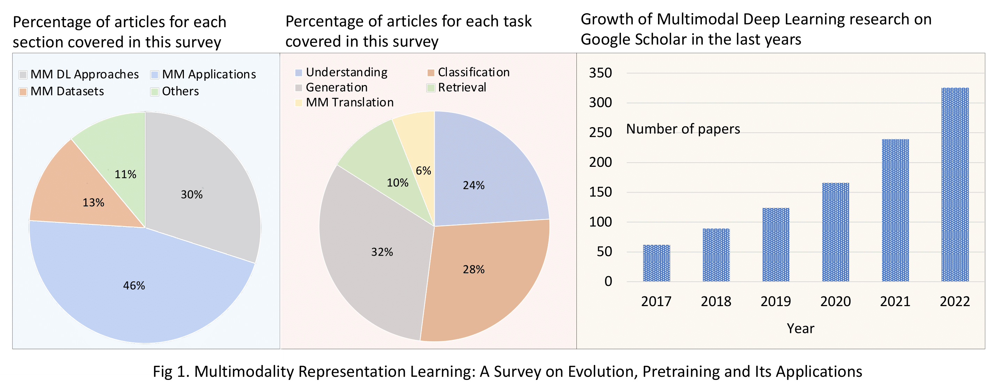

# Multimodality Representation Learning: A Survey on Evolution, Pretraining and Its Applications

## Multimodal Deep Learnig based Research

- [Survey Papers](#survey)
- [Task-specific Methods](#Task-specific-Methods)
- [Pretrainig Approaches](#Pretraining-Approaches)
- [Multimodal Applications](#Multimodal-Applications) ([Understanidng](#Understanding), [Classification](#Classification), [Generation](#Generation), [Retrieval](#Retrieval), [Translation](#Translation))
- [Multimodal Datasets](#Multimodal-Datasets)

# Survey

[**Multimodality Representation Learning: A Survey on Evolution, Pretraining and Its Applications.**](https://dl.acm.org/doi/abs/10.1145/3617833) <br>
*[Muhammad Arslan Manzoor](https://scholar.google.com/citations?hl=en&user=ZvXClnUAAAAJ), [Sarah Albarri](), [Ziting Xian](https://scholar.google.com/citations?hl=zh-CN&user=G7VId5YAAAAJ&view_op=list_works&gmla=AJsN-F6TTZmzbi9CmBIRLNRpAhcgmzH-nOUd8hM5UTjfT5A_mYW2ABzjSrdX7ki9GFgGaId2dLlMtXBkfq7X_qzYOwF_OuvCCthMiuVNUuUiac-aGoSwsKQ), [Zaiqiao Meng](https://scholar.google.com/citations?user=5jJKFVcAAAAJ&hl=en), [Preslav Nakov](https://scholar.google.com/citations?user=DfXsKZ4AAAAJ&hl=en), and [Shangsong Liang](https://scholar.google.com/citations?user=4uggVcIAAAAJ&h).*<br>
[[PDF](https://dl.acm.org/doi/abs/10.1145/3617833)] 

**Vision-Language Pre-training:Basics, Recent Advances, and Future Trends.**[17th Oct, 2022]<br>
*Zhe Gan, Linjie Li, Chunyuan Li, Lijuan Wang, Zicheng Liu, Jianfeng Gao.*<br>
[[PDF](https://arxiv.org/pdf/2210.09263.pdf)]

**VLP: A survey on vision-language pre-training.**[18th Feb, 2022]<br>
*Feilong Chen, Duzhen Zhang, Minglun Han, Xiuyi Chen, Jing Shi, Shuang Xu, and Bo Xu.*<br>
[[PDF](https://link.springer.com/article/10.1007/s11633-022-1369-5)]


**A Survey of Vision-Language Pre-Trained Models.**[18th Feb, 2022]<br>
*Yifan Du, Zikang Liu, Junyi Li, Wayne Xin Zhao.*<br>
[[PDF](https://arxiv.org/abs/2202.10936)]


**Vision-and-Language Pretrained Models: A Survey.**[15th Apr, 2022]<br>
*Siqu Long, Feiqi Cao, Soyeon Caren Han, Haiqin Yang.*<br>
[[PDF](https://arxiv.org/abs/2204.07356)]

**Comprehensive reading list for Multimodal Literature** <br>
[[Github](https://github.com/pliang279/awesome-multimodal-ml#survey-papers)]

**Pre-train, Prompt, and Predict: A Systematic Survey of Prompting Methods in Natural Language Processing.**[28th Jul, 2021]<br>
*Pengfei Liu, Weizhe Yuan, Jinlan Fu, Zhengbao Jiang, Hiroaki Hayashi, Graham Neubig*<br>
[[PDF](https://arxiv.org/abs/2107.13586)]

**Recent Advances and Trends in Multimodal Deep Learning: A Review.**[24th May, 2021]<br>
*Jabeen Summaira, Xi Li, Amin Muhammad Shoib, Songyuan Li, Jabbar Abdul.*<br>
[[PDF](https://arxiv.org/pdf/2105.11087)]


# Task-specific-Methods

**Improving Image Captioning by Leveraging Intra- and Inter-layer Global Representation in Transformer Network.**[9th Feb, 2021]

*Jiayi Ji, Yunpeng Luo, Xiaoshuai Sun, Fuhai Chen, Gen Luo, Yongjian Wu, Yue Gao, Rongrong Ji*

[[PDF](https://ojs.aaai.org/index.php/AAAI/article/view/16258)]

**Cascaded Recurrent Neural Networks for Hyperspectral Image Classification.**[Aug, 2019]

*Renlong Hang, Qingshan Liu, Danfeng Hong, Pedram Ghamisi*

[[PDF](https://ieeexplore.ieee.org/stamp/stamp.jsp?tp=&arnumber=8662780)]

**Faster R-CNN: Towards Real-Time Object Detection with Region Proposal Networks.**[2015 NIPS]

*Shaoqing Ren, Kaiming He, Ross Girshick, Jian Sun*

[[PDF](https://proceedings.neurips.cc/paper/2015/hash/14bfa6bb14875e45bba028a21ed38046-Abstract.html)]

**Microsoft coco: Common objects in context.**[2014 ECCV]

*Tsung-Yi Lin, Michael Maire, Serge Belongie, James Hays, Pietro Perona, Deva Ramanan, Piotr Dollar, C. Lawrence Zitnick*

[[PDF](https://arxiv.org/pdf/1405.0312.pdf%090.949.pdf)]

**Multimodal Deep Learning.**[2011 ICML]

*Jiquan Ngiam, Aditya Khosla, Mingyu Kim, Juhan Nam, Honglak Lee, Andrew Y. Ng*

[[PDF](http://ai.stanford.edu/~ang/papers/icml11-MultimodalDeepLearning.pdf)]

**Extracting and composing robust features with denoising autoencoders.**[5th July, 2008]

*Pascak Vincent, Hugo Larochelle, Yoshua Bengio, Pierre-Antoine Manzagol*

[[PDF](https://dl.acm.org/doi/pdf/10.1145/1390156.1390294)]

**Multi-Gate Attention Network for Image Captioning.**[13th Mar, 2021]

*WEITAO JIANG, XIYING LI, HAIFENG HU, QIANG LU, AND BOHONG LIU*

[[PDF](https://ieeexplore.ieee.org/stamp/stamp.jsp?tp=&arnumber=9382255)]

**AMC: Attention guided Multi-modal Correlation Learning for Image Search.**[2017 CVPR]

*Kan Chen, Trung Bui, Chen Fang, Zhaowen Wang, Ram Nevatia*

[[PDF](https://openaccess.thecvf.com/content_cvpr_2017/papers/Chen_AMC_Attention_guided_CVPR_2017_paper.pdf)]

**Video Captioning via Hierarchical Reinforcement Learning.**[2018 CVPR]

*Xin Wang, Wenhu Chen, Jiawei Wu, Yuan-Fang Wang, William Yang Wang*

[[PDF](https://openaccess.thecvf.com/content_cvpr_2018/papers/Wang_Video_Captioning_via_CVPR_2018_paper.pdf)]

**Gaussian Process with Graph Convolutional Kernel for Relational Learning.**[14th Aug, 2021]

*Jinyuan Fang, Shangsong Liang, Zaiqiao Meng, Qiang Zhang*

[[PDF](https://dl.acm.org/doi/pdf/10.1145/3447548.3467327)]

**Multi-Relational Graph Representation Learning with Bayesian Gaussian Process Network.**[28th June, 2022]

*Guanzheng Chen, Jinyuan Fang, Zaiqiao Meng, Qiang Zhang, Shangsong Liang*

[[PDF](https://doi.org/10.1609/aaai.v36i5.20492)]

# Pretraining-Approaches

**Learning Audio-Visual Speech Representation by Masked Multimodal Cluster Prediction.**[5th Jan, 2022]

*Bowen Shi, Wei-Ning Hsu, Kushal Lakhotia, Abdelrahman Mohamed*

[[PDF](https://proceedings.neurips.cc/paper/2019/hash/c74d97b01eae257e44aa9d5bade97baf-Abstract.html)]

**A Survey of Vision-Language Pre-Trained Models.**[18th Feb, 2022]

*Yifan Du, Zikang Liu, Junyi Li, Wayne Xin Zhao*

[[PDF](https://arxiv.org/abs/2202.10936)]

**Attention is All you Need.**[2017 NIPS]

*Ashish Vaswani, Noam Shazeer, Niki Parmar, Jakob Uszkoreit, Llion Jones, Aidan N. Gomez, Łukasz Kaiser, Illia Polosukhin*

[[PDF](https://proceedings.neurips.cc/paper/7181-attention-is-all)]

**VinVL: Revisiting Visual Representations in Vision-Language Models.**[2021 CVPR]

*Pengchuan Zhang, Xiujun Li, Xiaowei Hu, Jianwei Yang, Lei Zhang, Lijuan Wang, Yejin Choi, Jianfeng Gao*

[[PDF](http://openaccess.thecvf.com/content/CVPR2021/html/Zhang_VinVL_Revisiting_Visual_Representations_in_Vision-Language_Models_CVPR_2021_paper.html)]

**M6: Multi-Modality-to-Multi-Modality Multitask Mega-transformer for Unified Pretraining.**[Aug, 2021]

*Junyang Lin, Rui Men, An Yang, Chang Zhou, Yichang Zhang, Peng Wang, Jingren Zhou, Jie Tang, Hongxia Yang*

[[PDF](https://dl.acm.org/doi/abs/10.1145/3447548.3467206)]

**AMMU: A survey of transformer-based biomedical pretrained language models.**[23th Mar, 2020]

*Katikapalli Subramanyam Kalyan, Ajit Rajasekharan, Sivanesan Sangeetha*

[[PDF](https://www.sciencedirect.com/science/article/pii/S1532046421003117)]

**ELECTRA: Pre-training Text Encoders as Discriminators Rather Than Generators**

*Kevin Clark, Minh-Thang Luong, Quoc V. Le, Christopher D. Manning*

[[PDF](https://arxiv.org/abs/2003.10555)]

**RoBERTa: A Robustly Optimized BERT Pretraining Approach.**[26th Jul, 2019]

*Yinhan Liu, Myle Ott, Naman Goyal, Jingfei Du, Mandar Joshi, Danqi Chen, Omer Levy, Mike Lewis, Luke Zettlemoyer, Veselin Stoyanov*

[[PDF](https://arxiv.org/abs/1907.11692)]

**BERT: Pre-training of Deep Bidirectional Transformers for Language Understanding.**[11th Oct, 2018]

*Jacob Devlin, Ming-Wei Chang, Kenton Lee, Kristina Toutanova*

[[PDF](https://arxiv.org/abs/1810.04805)]

**BioBERT: a pre-trained biomedical language representation model for biomedical text mining.**[10th Sep, 2019]

Jinhyuk Lee, Wonjin Yoon, Sungdong Kim, onghyeon Kim, Sunkyu Kim, Chan Ho So, Jaewoo Kang

[[PDF](https://academic.oup.com/bioinformatics/article-abstract/36/4/1234/5566506)]

**HateBERT: Retraining BERT for Abusive Language Detection in English.**[23th Oct, 2020]

*Tommaso Caselli, Valerio Basile, Jelena Mitrovic, Michael Granitzer*

[[PDF](https://arxiv.org/abs/2010.12472)]

**InfoXLM: An Information-Theoretic Framework for Cross-Lingual Language Model Pre-Training.**[15th Jul, 2020]

*Zewen Chi, Li Dong, Furu Wei, Nan Yang, Saksham Singhal, Wenhui Wang, Xia Song, XIan-Ling Mao, Heyan Huang, Ming Zhou*

[[PDF](https://arxiv.org/abs/2007.07834)]

**Pre-training technique to localize medical BERT and enhance biomedical BERT.**[14th May, 2020]

*Shoya Wada, Toshihiro Takeda, Shiro Manabe, Shozo Konishi, Jun Kamohara, Yasushi, Matsumura*

[[PDF](https://arxiv.org/abs/2005.07202)]

**Don't Stop Pretraining: Adapt Language Models to Domains and Tasks.**[23th Apr, 2020]

*Suchin Gururangan, Ana Marasovic, Swabha Swayamdipta, Kyle Lo, Iz Beltagy, Doug Downey, Noah A. Smith*

[[PDF](https://arxiv.org/abs/2004.10964)]

**Knowledge Inheritance for Pre-trained Language Models.**[28th May, 2021]

*Yujia Qin, Yankai Lin, Jing Yi, Jiajie Zhang, Xu Han, Zhengyan Zhang, Yusheng Su, Zhiyuan Liu, Peng Li, Maosong Sun, Jie Zhou*

[[PDF](https://arxiv.org/abs/2105.13880)]

**Improving Language Understanding by Generative Pre-Training.**[2018]

*Alec Radford, Karthik Narasimhan, Tim Salimans, Ilya Sutskever*

[[PDF](https://www.cs.ubc.ca/~amuham01/LING530/papers/radford2018improving.pdf)]

**Shuffled-token Detection for Refining Pre-trained RoBERTa**

*Subhadarshi Panda, Anjali Agrawal, Jeewon Ha, Benjamin Bloch*

[[PDF](https://aclanthology.org/2021.naacl-srw.12/)]

**ALBERT: A Lite BERT for Self-supervised Learning of Language Representations.**[26th Sep, 2019]

*Zhenzhong Lan, Minga Chen, Sebastian Goodman, Kevin Gimpel, Piyush Sharma, Radu Soricut*

[[PDF](https://arxiv.org/abs/1909.11942)]

**Exploring the limits of transfer learning with a unified text-to-text transformer.**[1st Jan, 2020]

*Colin Raffel, Noam Shazeer, Adam Roberts, Katherine Lee, Sharan Narang, Michael Matena, Yanqi Zhou, Wei Li, Peter J. Liu*

[[PDF](https://dl.acm.org/doi/abs/10.5555/3455716.3455856)]

**End-to-End Object Detection with Transformers.**[3rd Nov, 2020]

*Nicolas Carion, Francisco Massa, Gabriel Synnaeve, Nicolas Usunier, Alexander Kirillov, Sergey Zagoruyko*

[[PDF](https://link.springer.com/chapter/10.1007/978-3-030-58452-8_13)]

**Deformable DETR: Deformable Transformers for End-to-End Object Detection.**[8th Oct, 2018]

Xizhou Zhu, Weijie Su, Lewei Lu, Bin Li, Xiaogang Wang, Jifeng Dai

[[PDF](https://arxiv.org/abs/2010.04159)]

**Unified Vision-Language Pre-Training for Image Captioning and VQA.**[2020 AAAI]

*Luowei Zhou, Hamid Palangi, Lei Zhang, Houdong Hu, Jason Corso, Jianfeng Gao*

[[PDF](https://ojs.aaai.org/index.php/AAAI/article/view/7005)]

**VirTex: Learning Visual Representations From Textual Annotations.**[2021 CVPR]

*Karan Desai, Justin Johnson*

[[PDF](http://openaccess.thecvf.com/content/CVPR2021/html/Desai_VirTex_Learning_Visual_Representations_From_Textual_Annotations_CVPR_2021_paper.html)]

**Ernie-vil: Knowledge enhanced vision-language representations through scene graphs.**[2021 AAAI]

*Fei Yu, Jiji Tang, Weichong Yin, Yu Sun, Hao Tian, Hua Wu, Haifeng Wang*

[[PDF](https://ojs.aaai.org/index.php/AAAI/article/view/16431)]

**OSCAR: Object-Semantics Aligned Pre-training for Vision-Language Tasks.**[24th Sep, 2020]

*Xiujun Li, Xi Yin, Chunyuan Li, Pengchuan Zhang, Xiaowei Hu, Lei Zhang, Lijuan Wang, Houdong Hu, Li Dong, Furu Wei, Yejin Choi, Jianfeng Gao*

[[PDF](https://link.springer.com/chapter/10.1007/978-3-030-58577-8_8)]

**Vokenization: Improving Language Understanding with Contextualized, Visual-Grounded Supervision.**[14th Oct, 2020]

*Hao Tan, Mohit Bansal*

[[PDF](https://arxiv.org/abs/2010.06775)]

**Flickr30k Entities: Collecting Region-to-Phrase Correspondences for Richer Image-to-Sentence Models.**[2015 ICCV]

*Bryan A. Plummer, Liwei Wang, Chris M. Cervantes, Juan C. Caicedo, Julia Hockenmaier, Svetlana Lazebnik*

[[PDF](http://openaccess.thecvf.com/content_iccv_2015/html/Plummer_Flickr30k_Entities_Collecting_ICCV_2015_paper.html)]

**Distributed representations of words and phrases and their compositionality.**[2013 NIPS]

*Tomas Mikolov, Ilya Sutskever, Kai Chen, Greg S. Corrado, Jeff Dean*

[[PDF](https://proceedings.neurips.cc/paper/2013/hash/9aa42b31882ec039965f3c4923ce901b-Abstract.html)]

**AllenNLP: A Deep Semantic Natural Language Processing Platform.**[20 Mar, 2018]

*Matt Gardner, Joel Grus, Mark Neumann, Oyvind Tafjord, Pradeep Dasigi, Nelson Liu, Matthew Peters, Michael Schmitz, Luke Zettlemoyer*

[[PDF](https://arxiv.org/abs/1803.07640)]

**Climbing towards NLU: On Meaning, Form, and Understanding in the Age of Data.**[Jul, 2020]

*Emily M. Bender, Alexander Koller*

[[PDF](https://aclanthology.org/2020.acl-main.463/)]

**Experience Grounds Language.**[21th Apr, 2020]

*Yonatan Bisk, Ari Holtzman, Jesse Thomason, Jacob Andreas, Yoshua Bengio, Joyce Chai, Mirella Lapata, Angeliki Lazaridou, Jonathan May, Aleksandr Nisnevich, Nicolas Pinto, Joseph Turian*

[[PDF](https://arxiv.org/abs/2004.10151)]

**Hubert: How Much Can a Bad Teacher Benefit ASR Pre-Training?**

*Wei-Ning Hsu, Yao-Hung Hubert Tsai, Benjamin Bolte, Ruslan Salakhutdinov, Abdelrahman Mohamed*

[[PDF](https://ieeexplore.ieee.org/abstract/document/9414460/)]

## Unifying Achitectures

**BERT: Pre-training of Deep Bidirectional Transformers for Language Understanding.**[11th Oct, 2018]

*Jacob Devlin, Ming-Wei Chang, Kenton Lee, Kristina Toutanova*

[[PDF](https://arxiv.org/abs/1810.04805)]

**Improving Language Understanding by Generative Pre-Training.**[2018]

*Alec Radford, Karthik Narasimhan, Tim Salimans, Ilya Sutskever*

[[PDF](https://www.cs.ubc.ca/~amuham01/LING530/papers/radford2018improving.pdf)]

**End-to-End Object Detection with Transformers.**[3rd Nov, 2020]

*Nicolas Carion, Francisco Massa, Gabriel Synnaeve, Nicolas Usunier, Alexander Kirillov, Sergey Zagoruyko*

[[PDF](https://link.springer.com/chapter/10.1007/978-3-030-58452-8_13)]

**UNITER: UNiversal Image-TExt Representation Learning.**[24th Sep, 2020]

*Yen-Chun Chen, Linjie Li, Licheng Yu, Ahmed EI Kholy, Faisal Ahmed, Zhe Gan, Yu Cheng, Jingjing Liu*

[[PDF](https://link.springer.com/chapter/10.1007/978-3-030-58577-8_7)]

**UNITER: UNiversal Image-TExt Representation Learning.**[2021 ICCV]

*Ronghang Hu, Amanpreet Singh*

[[PDF](https://openaccess.thecvf.com/content/ICCV2021/html/Hu_UniT_Multimodal_Multitask_Learning_With_a_Unified_Transformer_ICCV_2021_paper.html?ref=https://githubhelp.com)]

**VATT: Transformers for Multimodal Self-Supervised Learning from Raw Video, Audio and Text.**[2021 NIPS]

*Hassan Akbari, Liangzhe Yuan, Rui Qian, Wei-Hong Chuang, Shih-Fu Chang, Yin Cui, Boqing Gong*

[[PDF](https://proceedings.neurips.cc/paper/2021/hash/cb3213ada48302953cb0f166464ab356-Abstract.html)]

**OFA: Unifying Architectures, Tasks, and Modalities Through a Simple Sequence-to-Sequence Learning Framework.**[2022 ICML]

*Peng Wang, An Yang, Rui Men, Junyang Lin, Shuai Bai, Zhikang Li, Jianxin Ma, Chang Zhou, Jingren Zhou, Hongxia Yang* 

[[PDF](https://proceedings.mlr.press/v162/wang22al.html)]

**BART: Denoising Sequence-to-Sequence Pre-training for Natural Language Generation, Translation, and Comprehension.**[29th Oct, 2019]

*Mike Lewis, Yinhan Liu, Naman Goyal, Marjan Ghazvininejad, Abdelrahman Mohamed, Omer Levy, Ves Stoyanov, Luke Zettlemoyer*

[[PDF](https://arxiv.org/abs/1910.13461)]

# Multimodal-Applications

## Understanding
  
**Learning Audio-Visual Speech Representation by Masked Multimodal Cluster Prediction.**[5th Jan, 2022]

*Bowen Shi, Wei-Ning Hsu, Kushal Lakhotia, Abdelrahman Mohamed*

[[PDF](https://arxiv.org/abs/2201.02184)]

**Self-Supervised Multimodal Opinion Summarization.**[27th May, 2021]

*Jinbae lm, Moonki Kim, Hoyeop Lee, Hyunsouk Cho, Sehee Chung*

[[PDF](https://arxiv.org/abs/2105.13135)]

**Hubert: How Much Can a Bad Teacher Benefit ASR Pre-Training?**

*Wei-Ning Hsu, Yao-Hung Hubert Tsai, Benjamin Bolte, Ruslan Salakhutdinov, Abdelrahman Mohamed*

[[PDF](https://ieeexplore.ieee.org/abstract/document/9414460/)]

**LayoutLMv2: Multi-modal Pre-training for Visually-Rich Document Understanding.**[29th Dec, 2020]

*Yang Xu, Yiheng Xu, Tengchao Lv, Lei Cui, Furu Wei, Guoxin Wang, Yijuan Lu, Dinei Florencio, Cha Zhang, Wanxiang Che, Min Zhang, Lidong Zhou*

[[PDF](https://arxiv.org/abs/2012.14740)]

**Structext: Structured text understanding with multi-modal transformers.**[17th Oct, 2021]

*Yulin Li, Yuxi Qian, Yuechen Yu, Xiameng Qin, Chengquan Zhang, Yan Liu, Kun Yao, Junyu Han, Jingtuo Liu, Errui Ding*

[[PDF](https://dl.acm.org/doi/abs/10.1145/3474085.3475345)]

**ICDAR2019 Competition on Scanned Receipt OCR and Information Extraction.**[20th Sep, 2019]

*Zheng Huang, Kai Chen, Jianhua He, Xiang Bai, Dimosthenis Karatzas, Shijian Lu, C. V. Jawahar*

[[PDF](https://ieeexplore.ieee.org/abstract/document/8977955/)]

**FUNSD: A Dataset for Form Understanding in Noisy Scanned Documents.**[20th Sep, 2019]

*Guillaume Jaume, Hazim Kemal Ekenel, Jean-Philippe Thiran*

[[PDF](https://ieeexplore.ieee.org/abstract/document/8892998/)]

**XYLayoutLM: Towards Layout-Aware Multimodal Networks for Visually-Rich Document Understanding.**[2022 CVPR]

*Zhangxuan Gu, Changhua Meng, Ke Wang, Jun Lan, Weiqiang Wang, Ming Gu, Liqing Zhang*

[[PDF](http://openaccess.thecvf.com/content/CVPR2022/html/Gu_XYLayoutLM_Towards_Layout-Aware_Multimodal_Networks_for_Visually-Rich_Document_Understanding_CVPR_2022_paper.html)]

**Multistage Fusion with Forget Gate for Multimodal Summarization in Open-Domain Videos.**[2022 EMNLP]

*Nayu Liu, Xian SUn, Hongfeng Yu, Wenkai Zhang, Guangluan Xu*

[[PDF](https://aclanthology.org/2020.emnlp-main.144/)]

**Multimodal Abstractive Summarization for How2 Videos.**[19th Jun, 2019]

*Shruti Palaskar, Jindrich Libovicky, Spandana Gella, Florian Metze*

[[PDF](https://arxiv.org/abs/1906.07901)]

**Vision guided generative pre-trained language models for multimodal abstractive summarization.**[6th Sep, 2021]

*Tiezheng Yu, Wenliang Dai, Zihan Liu, Pascale Fung*

[[PDF](https://arxiv.org/abs/2109.02401)]

**How2: A Large-scale Dataset for Multimodal Language Understanding.**[1st Nov, 2018]

*Ramon Sanabria, Ozan Caglayan, Shruti Palaskar, Desmond Elliott, Loic Barrault, Lucia Specia, Florian Metze*

[[PDF](https://arxiv.org/abs/1811.00347)]

**wav2vec 2.0: A framework for self-supervised learning of speech representations.**[2020 NIPS]

*Alexei Baevski, Yuhao Zhou, Abdelrahman Mohamed, Michael Auli*

[[PDF](https://proceedings.neurips.cc/paper/2020/hash/92d1e1eb1cd6f9fba3227870bb6d7f07-Abstract.html)]

**DeCoAR 2.0: Deep Contextualized Acoustic Representations with Vector Quantization.**[11th Dec, 2020]

*Shaoshi Ling, Yuzong Liu*

[[PDF](https://arxiv.org/abs/2012.06659)]

**LRS3-TED: a large-scale dataset for visual speech recognition.**[3rd Sep, 2018]

*Triantafyllos Afouras, Joon Son Chung, Andrew Zisserman*

[[PDF](https://arxiv.org/abs/1809.00496)]

**Recurrent Neural Network Transducer for Audio-Visual Speech Recognition.**[Dec 2019]

*Takaki Makino, Hank Liao, Yannis Assael, Brendan Shillingford, Basilio Garcia, Otavio Braga, Olivier Siohan*

[[PDF](https://ieeexplore.ieee.org/abstract/document/9004036/)]

**Learning Individual Speaking Styles for Accurate Lip to Speech Synthesis.**[2020 CVPR]

*K R Prajwal, Rudrabha Mukhopadhyay, Vinay P. Namboodiri, C.V. Jawahar*

[[PDF](http://openaccess.thecvf.com/content_CVPR_2020/html/Prajwal_Learning_Individual_Speaking_Styles_for_Accurate_Lip_to_Speech_Synthesis_CVPR_2020_paper.html)]

**On the importance of super-Gaussian speech priors for machine-learning based speech enhancement.**[28th Nov, 2017]

*Robert Rehr, Timo Gerkmann*

[[PDF](https://ieeexplore.ieee.org/abstract/document/8121999/)]

**Active appearance models.**[1998 ECCV]

*T. F. Cootes, G. J. Edwards, C. J. Taylor*

[[PDF](https://link.springer.com/chapter/10.1007/BFb0054760)]

**Leveraging category information for single-frame visual sound source separation.**[20th Jul, 2021]

*Lingyu Zhu, Esa Rahtu*

[[PDF](https://ieeexplore.ieee.org/abstract/document/9484036/)]

**The Sound of Pixels.**[2018 ECCV]

*Hang Zhao, Chuang Gan, Andrew Rouditchenko, Carl Vondrick, Josh McDermott, Antonio Torralba*

[[PDF](http://openaccess.thecvf.com/content_ECCV_2018/html/Hang_Zhao_The_Sound_of_ECCV_2018_paper.html)]

## Classification

**Vqa: Visual question answering.**[2015 ICCV]

*Stanislaw Antol, Aishwarya Agrawal, Jiasen Lu, Margaret Mitchell, Dhruv Batra, C. Lawrence Zitnick, Devi Parikh*

[[PDF](http://openaccess.thecvf.com/content_iccv_2015/html/Antol_VQA_Visual_Question_ICCV_2015_paper.html)]

**Topic-based content and sentiment analysis of Ebola virus on Twitter and in the news.**[1th Jul, 2016]

*Erin Hea-Jin Kim, Yoo Kyung Jeong, Yuyong Kim, Keun Young kang, Min Song*

[[PDF](https://journals.sagepub.com/doi/pdf/10.1177/0165551515608733)]

**On the Role of Text Preprocessing in Neural Network Architectures: An Evaluation Study on Text Categorization and Sentiment Analysis.**[6th Jul, 2017]

*Jose Camacho-Collados, Mohammad Taher Pilehvar*

[[PDF](https://arxiv.org/abs/1707.01780)]

**Market strategies used by processed food manufacturers to increase and consolidate their power: a systematic review and document analysis.**[26th Jan, 2021]

*Benjamin Wood, Owain Williams, Vijaya Nagarajan, Gary Sacks*

[[PDF](https://globalizationandhealth.biomedcentral.com/articles/10.1186/s12992-021-00667-7)]

**Swafn: Sentimental words aware fusion network for multimodal sentiment analysis.**[2020 COLING]

*Minping Chen, Xia Li*

[[PDF](https://aclanthology.org/2020.coling-main.93/)]

**Adaptive online event detection in news streams.**[15th Dec, 2017]

*Linmei Hu, Bin Zhang, Lei Hou, Juanzi Li*

[[PDF](https://www.sciencedirect.com/science/article/pii/S0950705117304550)]

**Multi-source multimodal data and deep learning for disaster response: A systematic review.**[27th Nov, 2021]

*Nilani Algiriyage, Raj Prasanna, Kristin Stock, Emma E. H. Doyle, David Johnston*

[[PDF](https://link.springer.com/article/10.1007/s42979-021-00971-4)]

**A Survey of Data Representation for Multi-Modality Event Detection and Evolution.**[2nd Nov, 2021]

Kejing Xiao, Zhaopeng Qian, Biao Qin.

[[PDF](https://www.mdpi.com/2076-3417/12/4/2204)]

**Crisismmd: Multimodal twitter datasets from natural disasters.**[15th Jun, 2018]

*Firoj Alam, Ferda Ofli, Muhammad Imran*

[[PDF](https://www.aaai.org/ocs/index.php/ICWSM/ICWSM18/paper/viewPaper/17816)]

**Multi-modal generative adversarial networks for traffic event detection in smart cities.**[1st Sep, 2021]

*Qi Chen, WeiWang, Kaizhu Huang, Suparna De, Frans Coenen*

[[PDF](https://www.sciencedirect.com/science/article/pii/S0957417421003808)]

**Proppy: Organizing the news based on their propagandistic content.**[5th Sep, 2019]

*Alberto Barron-Cedeno, Israa Jaradat, Giovanni Da San Martino, Preslav Nakov*

[[PDF](https://www.sciencedirect.com/science/article/pii/S0306457318306058)]

**Fine-grained analysis of propaganda in news article.**[Nov 2019]

*Giovanni Da San Martino, Seunghak Yu, Alberto Barron-Cedeno, Rostislav Petrov, Preslav Nakov*

[[PDF](https://aclanthology.org/D19-1565/)]

**Multimodal Fusion with Recurrent Neural Networks for Rumor Detection on Microblogs.**[Oct, 2017]

*Zhiwei Jin, Juan Cao, Han Guo, Yongdong Zhang, Jiebo Luo*

[[PDF](https://dl.acm.org/doi/abs/10.1145/3123266.3123454)]

**𝖲𝖠𝖥𝖤: Similarity-Aware Multi-modal Fake News Detection.**[6th May, 2020]

*Xinyi Zhou, Jindi Wu, Reza Zafarani*

[[PDF](https://link.springer.com/chapter/10.1007/978-3-030-47436-2_27)]

**From Recognition to Cognition: Visual Commonsense Reasoning.**[2019 CVPR]

*Rowan Zellers, Yonatan Bisk, Ali Farhadi, Yejin Choi*

[[PDF](http://openaccess.thecvf.com/content_CVPR_2019/html/Zellers_From_Recognition_to_Cognition_Visual_Commonsense_Reasoning_CVPR_2019_paper.html)]

**KVL-BERT: Knowledge Enhanced Visual-and-Linguistic BERT for visual commonsense reasoning.**[27th Oct, 2021]

*Dandan Song, Siyi Ma, Zhanchen Sun, Sicheng Yang, Lejian Liao*

[[PDF](https://www.sciencedirect.com/science/article/pii/S0950705121006705)]

**LXMERT: Learning Cross-Modality Encoder Representations from Transformers.**[20th Aug, 2019]

*Hao Tan, Mohit Bansal*

[[PDF](https://arxiv.org/abs/1908.07490)]

**Pixel-BERT: Aligning Image Pixels with Text by Deep Multi-Modal Transformers.**[2 Apr, 2020]

Zhicheng Huang, Zhaoyang Zeng, Bei Liu, Dongmei Fu, Jianlong Fu

[[PDF](https://arxiv.org/abs/2004.00849)]

**Vision-Language Navigation With Self-Supervised Auxiliary Reasoning Tasks.**[2020 CVPR]

*Fengda Zhu, Yi Zhu, Xiaojun Chang, Xiaodan Liang*

[[PDF](http://openaccess.thecvf.com/content_CVPR_2020/html/Zhu_Vision-Language_Navigation_With_Self-Supervised_Auxiliary_Reasoning_Tasks_CVPR_2020_paper.html)]

## Generation

**Recent advances and trends in multimodal deep learning: A review.**[24th May, 2021]

Jabeen Summaira, Xi Li, Amin Muhammad Shoib, Songyuan Li, Jabbar Abdul

[[PDF](https://arxiv.org/abs/2105.11087)]

**Vqa: Visual question answering.**[2015 ICCV]

*Stanislaw Antol, Aishwarya Agrawal, Jiasen Lu, Margaret Mitchell, Dhruv Batra, C. Lawrence Zitnick, Devi Parikh*

[[PDF](http://openaccess.thecvf.com/content_iccv_2015/html/Antol_VQA_Visual_Question_ICCV_2015_paper.html)]

**Microsoft coco: Common objects in context.**[2014 ECCV]

*Tsung-Yi Lin, Michael Maire, Serge Belongie, James Hays, Pietro Perona, Deva Ramanan, Piotr Dollar, C. Lawrence Zitnick*

[[PDF](https://arxiv.org/pdf/1405.0312.pdf%090.949.pdf)]

**BERT: Pre-training of Deep Bidirectional Transformers for Language Understanding.**[11th Oct, 2018]

*Jacob Devlin, Ming-Wei Chang, Kenton Lee, Kristina Toutanova*

[[PDF](https://arxiv.org/abs/1810.04805)]

**Distributed Representations of Words and Phrases and their Compositionality.**[2013 NIPS]

*Tomas Mikolov, Ilya Sutskever, Kai Chen, Greg S. Corrado, Jeff Dean*

[[PDF](https://proceedings.neurips.cc/paper/2013/hash/9aa42b31882ec039965f3c4923ce901b-Abstract.html)]

**LRS3-TED: a large-scale dataset for visual speech recognition.**[3rd Sep, 2018]

*Triantafyllos Afouras, Joon Son Chung, Andrew Zisserman*

[[PDF](https://arxiv.org/abs/1809.00496)]

**A lip sync expert is all you need for speech to lip generation in the wild.**[12th Oct, 2019]

*K R Prajwal, Rudrabha Mukhopadhyay, Vinay P. Namboodiri, C.V. Jawahar*

[[PDF](https://dl.acm.org/doi/abs/10.1145/3394171.3413532)]

**Unified Vision-Language Pre-Training for Image Captioning and VQA.**[2020 AAAI]

*Luowei Zhou, Hamid Palangi, Lei Zhang, Houdong Hu, Jason Corso, Jianfeng Gao*

[[PDF](https://ojs.aaai.org/index.php/AAAI/article/view/7005)]

**Show and Tell: A Neural Image Caption Generator.**[2015 CVPR]

*Oriol Vinyals, Alexander Toshev, Samy Bengio, Dumitru Erhan*

[[PDF](https://www.cv-foundation.org/openaccess/content_cvpr_2015/html/Vinyals_Show_and_Tell_2015_CVPR_paper.html)]

**SCA-CNN: Spatial and Channel-Wise Attention in Convolutional Networks for Image Captioning.**[2017 CVPR]

*Long Chen, Hanwang Zhang, Jun Xiao, Liqiang Nie, Jian Shao, Wei Liu, Tat-Seng Chua*

[[PDF](http://openaccess.thecvf.com/content_cvpr_2017/html/Chen_SCA-CNN_Spatial_and_CVPR_2017_paper.html)]

**Self-Critical Sequence Training for Image Captioning.**[2017 CVPR]

*Steven J. Rennie, Etienne Marcheret, Youssef Mroueh, Jerret Ross, Vaibhava Goel*

[[PDF](http://openaccess.thecvf.com/content_cvpr_2017/html/Rennie_Self-Critical_Sequence_Training_CVPR_2017_paper.html)]

**Visual question answering: A survey of methods and datasets.**[Oct, 2017]

*Qi WU, Damien Teney, Peng Wang, Chunhua Shen, Anthony Dick, Anton van den Hengel*

[[PDF](https://www.sciencedirect.com/science/article/pii/S1077314217300772)]

**How to find a good image-text embedding for remote sensing visual question answering?.**[24th Sep, 2021]

*Christel Chappuis, Sylvain Lobry, Benjamin Kellenberger, Bertrand Le, Saux, Devis Tuia*

[[PDF](https://arxiv.org/abs/2109.11848)]

**An Improved Attention for Visual Question Answering.**[2021 CVPR]

*Tanzila Rahman, Shih-Han Chou, Leonid Sigal, Giuseppe Carenini*

[[PDF](https://openaccess.thecvf.com/content/CVPR2021W/MULA/html/Rahman_An_Improved_Attention_for_Visual_Question_Answering_CVPRW_2021_paper.html)]

**Analyzing Compositionality of Visual Question Answering.**[2019 NIPS]

*Sanjay Subramanian, Sameer Singh, Matt Gardner*

[[PDF](https://vigilworkshop.github.io/static/papers-2019/43.pdf)]

**OK-VQA: A Visual Question Answering Benchmark Requiring External Knowledge.**[2019 CVPR]

*Kenneth Marino, Mohammad Rastegari, Ali Farhadi, Roozbeh Mottaghi*

[[PDF](http://openaccess.thecvf.com/content_CVPR_2019/html/Marino_OK-VQA_A_Visual_Question_Answering_Benchmark_Requiring_External_Knowledge_CVPR_2019_paper.html)]

**MultiBench: Multiscale Benchmarks for Multimodal Representation Learning.**[15th Jul, 2021]

*Paul Pu Liang, Yiwei Lyu, Xiang Fan, Zetian Wu, Yun Cheng,
Jason Wu, Leslie Chen, Peter Wu, Michelle A. Lee, Yuke Zhu5,
Ruslan Salakhutdinov1, Louis-Philippe Morency*

[[PDF](https://arxiv.org/abs/2107.07502)]

**Benchmarking Multimodal AutoML for Tabular Data with Text Fields.**[4th Nov, 20201]

Xingjian Shi, Jonas Mueller, Nick Erickson, Mu Li, Alexander J. Smola

[[PDF](https://arxiv.org/abs/2111.02705)]

**Multimodal Explanations: Justifying Decisions and Pointing to the Evidence.**[2018 CVPR]

*Dong Huk Park, Lisa Anne Hendricks, Zeynep Akata, Anna Rohrbach, Bernt Schiele, Trevor Darrell, Marcus Rohrbach*

[[PDF](http://openaccess.thecvf.com/content_cvpr_2018/html/Park_Multimodal_Explanations_Justifying_CVPR_2018_paper.html)]

**Don't Just Assume; Look and Answer: Overcoming Priors for Visual Question Answering.**[2018 CVPR]

*Aishwarya Agrawal, Dhruv Batra, Devi Parikh, Aniruddha Kembhavi*

[[PDF](http://openaccess.thecvf.com/content_cvpr_2018/html/Agrawal_Dont_Just_Assume_CVPR_2018_paper.html)]

**Generative Adversarial Text to Image Synthesis.**[2016 ICML]

*Scott Reed, Zeynep Akata, Xinchen Yan, Lajanugen Logeswaran, Bernt Schiele, Honglak Lee*

[[PDF](http://proceedings.mlr.press/v48/reed16.html)]

**The Caltech-UCSD Birds-200-2011 Dataset.**

[[PDF](https://authors.library.caltech.edu/27452/)]

**AttnGAN: Fine-Grained Text to Image Generation With Attentional Generative Adversarial Networks.**[2018 CVPR]

*Tao Xu, Pengchuan Zhang, Qiuyuan Huang, Han Zhang, Zhe Gan, Xiaolei Huang, Xiaodong He*

[[PDF](http://openaccess.thecvf.com/content_cvpr_2018/html/Xu_AttnGAN_Fine-Grained_Text_CVPR_2018_paper.html)]

**LipSound: Neural Mel-spectrogram Reconstruction for Lip Reading.**[15 Sep, 2019]

*Leyuan Qu, Cornelius Weber, Stefan Wermter*

[[PDF](https://www.isca-speech.org/archive_v0/Interspeech_2019/pdfs/1393.pdf)]

**The Conversation: Deep Audio-Visual Speech Enhancement.**[11th Apr, 2018]

*Triantafyllos Afouras, Joon Son Chung, Andrew Zisserman*

[[PDF](https://arxiv.org/abs/1804.04121)]

**TCD-TIMIT: An Audio-Visual Corpus of Continuous Speech.**[5th May, 2015]

*Naomi Harte, Eoin Gillen*

[[PDF](https://ieeexplore.ieee.org/abstract/document/7050271/)]

**Deep Voice 3: Scaling Text-to-Speech with Convolutional Sequence Learning.**[20 Oct, 2017]

*WeiPing, KainanPeng, AndrewGibiansk, SercanO. Arık, Ajay Kannan, Sharan Narang*

[[PDF](https://arxiv.org/abs/1710.07654)]

**Natural TTS Synthesis by Conditioning Wavenet on MEL Spectrogram Predictions.**[15th Apr, 2018]

*Jonathan Shen, Ruiming Pang, Ron J. Weiss, Mile Schuster, Navdeep Jaitly, Zongheng Yang, Zhifeng Chen, Yu Zhang, Yuxuan Wang, Rj Skerrv-Ryan, Rif A. Saurous, Yannis Agiomvrgiannakis, Yonghui Wu*

[[PDF](https://ieeexplore.ieee.org/abstract/document/8461368/)]

**Vid2speech: Speech reconstruction from silent video.**[5th Mar, 2017]

*Ariel Ephrat, Shmuel Peleg*

[[PDF](https://ieeexplore.ieee.org/abstract/document/7953127/)]

**Lip2Audspec: Speech Reconstruction from Silent Lip Movements Video.**[15th Apr, 2018]

*Hassan Akbari, Himani Arora, Liangliang Cao, Nima Mesgarani*

[[PDF](https://ieeexplore.ieee.org/abstract/document/8461856/)]

**Video-Driven Speech Reconstruction using Generative Adversarial Networks.**[14th Jun, 2019]

*Konstantinos Vougioukas, Pingchuan Ma, Stavros Petridi, Maja Pantic*

[[PDF](https://arxiv.org/abs/1906.06301)]

## Retrieval

**ViLBERT: Pretraining Task-Agnostic Visiolinguistic Representations for Vision-and-Language Tasks.**[2019 NIPS]

*Jiasen Lu, Dhruv Batra, Devi Parikh, Stefan Lee*

[[PDF](https://proceedings.neurips.cc/paper/2019/hash/c74d97b01eae257e44aa9d5bade97baf-Abstract.html)]

**Learning Robust Patient Representations from Multi-modal Electronic Health Records: A Supervised Deep Learning Approach.**[2021]

*Leman Akoglu, Evimaria Terzi, Xianli Zhang, Buyue Qian, Yang Liu, Xi Chen, Chong Guan, Chen Li*

[[PDF](https://epubs.siam.org/doi/abs/10.1137/1.9781611976700.66)]

**Referring Expression Comprehension: A Survey of Methods and Datasets.**[7th Dec, 2020]

*Yanyuan QIao, Chaorui Deng, Qi Wu*

[[PDF](https://ieeexplore.ieee.org/abstract/document/9285213/)]

**VL-BERT: Pre-training of Generic Visual-Linguistic Representations.**[22th Aug, 2019]

*Weijie Su, Xizhou Zhu, Yue Cao, Bin Li, Lewei Lu, Furu Wei, Jifeng Dai*

[[PDF](https://arxiv.org/abs/1908.08530)]

**Clinically Accurate Chest X-Ray Report Generation.**[2019 MLHC]

*Guanxiong Liu, Tzu-Ming Harry Hsu, Matthew McDermott, Willie Boag, Wei-Hung Weng, Peter Szolovits, Marzyeh Ghassemi*

[[PDF](http://proceedings.mlr.press/v106/liu19a.html)]

## Translation

**Deep Residual Learning for Image Recognition.**[2016 CVPR]

*Kaiming He, Xiangyu Zhang, Shaoqing Ren, Jian Sun*

[[PDF](http://openaccess.thecvf.com/content_cvpr_2016/html/He_Deep_Residual_Learning_CVPR_2016_paper.html)]

**Probing the Need for Visual Context in Multimodal Machine Translation.**[20th Mar, 2019]

*Ozan Caglayan, Pranava Madhyastha, Lucia Specia, Loic Barrault*

[[PDF](https://arxiv.org/abs/1903.08678)]

**Neural Machine Translation by Jointly Learning to Align and Translate.**[1st Sep, 2014]

*Dzmitry Bahdanau, Kyunghyun Cho, Yoshua Bengio*

[[PDF](https://arxiv.org/abs/1409.0473)]

**Multi-modal neural machine translation with deep semantic interactions.**[Apr, 2021]

*Jinsong Su, Jinchang Chen, Hui Jiang, Chulun Zhou, Huan Lin, Yubin Ge, Qingqiang Wu, Yongxuan Lai*

[[PDF](https://www.sciencedirect.com/science/article/pii/S0020025520311105)]

# Multimodal-Datasets

Vqa: Visual question answering.**[2015 ICCV]

*Stanislaw Antol, Aishwarya Agrawal, Jiasen Lu, Margaret Mitchell, Dhruv Batra, C. Lawrence Zitnick, Devi Parikh*

[[PDF](http://openaccess.thecvf.com/content_iccv_2015/html/Antol_VQA_Visual_Question_ICCV_2015_paper.html)]

**Microsoft coco: Common objects in context.**[2014 ECCV]

*Tsung-Yi Lin, Michael Maire, Serge Belongie, James Hays, Pietro Perona, Deva Ramanan, Piotr Dollar, C. Lawrence Zitnick*

[[PDF](https://arxiv.org/pdf/1405.0312.pdf%090.949.pdf)]

**Pre-training technique to localize medical BERT and enhance biomedical BERT.**[14th May, 2020]

*Shoya Wada, Toshihiro Takeda, Shiro Manabe, Shozo Konishi, Jun Kamohara, Yasushi, Matsumura*

[[PDF](https://arxiv.org/abs/2005.07202)]

**Flickr30k Entities: Collecting Region-to-Phrase Correspondences for Richer Image-to-Sentence Models.**[2015 ICCV]

*Bryan A. Plummer, Liwei Wang, Chris M. Cervantes, Juan C. Caicedo, Julia Hockenmaier, Svetlana Lazebnik*

[[PDF](http://openaccess.thecvf.com/content_iccv_2015/html/Plummer_Flickr30k_Entities_Collecting_ICCV_2015_paper.html)]

**ICDAR2019 Competition on Scanned Receipt OCR and Information Extraction.**[20th Sep, 2019]

*Zheng Huang, Kai Chen, Jianhua He, Xiang Bai, Dimosthenis Karatzas, Shijian Lu, C. V. Jawahar*

[[PDF](https://ieeexplore.ieee.org/abstract/document/8977955/)]

**FUNSD: A Dataset for Form Understanding in Noisy Scanned Documents.**[20th Sep, 2019]

*Guillaume Jaume, Hazim Kemal Ekenel, Jean-Philippe Thiran*

[[PDF](https://ieeexplore.ieee.org/abstract/document/8892998/)]

**How2: A Large-scale Dataset for Multimodal Language Understanding.**[1st Nov, 2018]

*Ramon Sanabria, Ozan Caglayan, Shruti Palaskar, Desmond Elliott, Loic Barrault, Lucia Specia, Florian Metze*

[[PDF](https://arxiv.org/abs/1811.00347)]

**Learning Individual Speaking Styles for Accurate Lip to Speech Synthesis.**[2020 CVPR]

*K R Prajwal, Rudrabha Mukhopadhyay, Vinay P. Namboodiri, C.V. Jawahar*

[[PDF](http://openaccess.thecvf.com/content_CVPR_2020/html/Prajwal_Learning_Individual_Speaking_Styles_for_Accurate_Lip_to_Speech_Synthesis_CVPR_2020_paper.html)]

**The Sound of Pixels.**[2018 ECCV]

*Hang Zhao, Chuang Gan, Andrew Rouditchenko, Carl Vondrick, Josh McDermott, Antonio Torralba*

[[PDF](http://openaccess.thecvf.com/content_ECCV_2018/html/Hang_Zhao_The_Sound_of_ECCV_2018_paper.html)]

**Crisismmd: Multimodal twitter datasets from natural disasters.**[15th Jun, 2018]

*Firoj Alam, Ferda Ofli, Muhammad Imran*

[[PDF](https://www.aaai.org/ocs/index.php/ICWSM/ICWSM18/paper/viewPaper/17816)]

**From Recognition to Cognition: Visual Commonsense Reasoning.**[2019 CVPR]

*Rowan Zellers, Yonatan Bisk, Ali Farhadi, Yejin Choi*

[[PDF](http://openaccess.thecvf.com/content_CVPR_2019/html/Zellers_From_Recognition_to_Cognition_Visual_Commonsense_Reasoning_CVPR_2019_paper.html)]

**The Caltech-UCSD Birds-200-2011 Dataset.**

[[PDF](https://authors.library.caltech.edu/27452/)]

**Framing Image Description as a Ranking Task: Data, Models and Evaluation Metrics.**[30th Aug, 2013]

*M. Hodosh, P. Young, J. Hockenmaier*

[[PDF](https://www.jair.org/index.php/jair/article/view/10833)]

**Multimodal Language Analysis in the Wild: CMU-MOSEI Dataset and Interpretable Dynamic Fusion Graph.**[Jul, 2018]

*AmirAli Bagher Zadeh, Paul Pu Liang, Soujanya Poria, Erik Cambria, Louis-Philippe Morency*

[[PDF](https://aclanthology.org/P18-1208/)]

**MIMIC-III, a freely accessible critical care database.**[24th May, 2016]

*Alistair E.W. Johnson, Tom J. Pollard, Li-wei H. Lehman, Mengling Feng, Mohammad Ghassemi, Benjamin Moody, Leo Anthony Celi & Roger G. Mark*

[[PDF](https://www.nature.com/articles/sdata201635)]

**Fashion 200K Benchmark**

[[Github](https://github.com/xthan/fashion-200k)]

**Indoor scene segmentation using a structured light sensor.**[Nov 2011]

*Nathan Silberman, Rob Fergus*

[[PDF](https://ieeexplore.ieee.org/abstract/document/6130298/)]

**Indoor Segmentation and Support Inference from RGBD Images.**[2012 ECCV]

*Nathan Silberman, Derek Hoiem, Pushmeet Kohli, Rob Fergus*

[[PDF](https://www.microsoft.com/en-us/research/wp-content/uploads/2016/11/shkf_eccv2012.pdf)]

**Good News, Everyone! Context Driven Entity-Aware Captioning for News Images.**[2019 CVPR]

*Ali Furkan Biten, Lluis Gomez, Marcal Rusinol, Dimosthenis Karatzas*

[[PDF](http://openaccess.thecvf.com/content_CVPR_2019/html/Biten_Good_News_Everyone_Context_Driven_Entity-Aware_Captioning_for_News_Images_CVPR_2019_paper.html)]

**MSR-VTT: A Large Video Description Dataset for Bridging Video and Language.**[2016 CVPR]

*Jun Xu, Tao Mei, Ting Yao, Yong Rui*

[[PDF](http://openaccess.thecvf.com/content_cvpr_2016/html/Xu_MSR-VTT_A_Large_CVPR_2016_paper.html)]

**Video Question Answering via Gradually Refined Attention over Appearance and Motion.**[Oct, 2017]

*Dejing Xu, Zhou Zhao, Jun Xiao, Fei Wu, Hanwang Zhang, Xiangnan He, Yueting Zhuang*

[[PDF](https://dl.acm.org/doi/abs/10.1145/3123266.3123427)]

**TGIF-QA: Toward Spatio-Temporal Reasoning in Visual Question Answering.**[2017 CVPR]

*Yunseok Jang, Yale Song, Youngjae Yu, Youngjin Kim, Gunhee Kim*

[[PDF](http://openaccess.thecvf.com/content_cvpr_2017/html/Jang_TGIF-QA_Toward_Spatio-Temporal_CVPR_2017_paper.html)]

**Multi-Target Embodied Question Answering.**[2019 CVPR]

*Licheng Yu, Xinlei Chen, Georgia Gkioxari, Mohit Bansal, Tamara L. Berg, Dhruv Batra*

[[PDF](http://openaccess.thecvf.com/content_CVPR_2019/html/Yu_Multi-Target_Embodied_Question_Answering_CVPR_2019_paper.html)]

**VideoNavQA: Bridging the Gap between Visual and Embodied Question Answering.**[14th Aug, 2019]

*Catalina Cangea, Eugene Belilovsky, Pietro Lio, Aaron Courville*

[[PDF](https://arxiv.org/abs/1908.04950)]

**An Analysis of Visual Question Answering Algorithms.**[2017 ICCV]

*Kushal Kafle, Christopher Kanan*

[[PDF](http://openaccess.thecvf.com/content_iccv_2017/html/Kafle_An_Analysis_of_ICCV_2017_paper.html)]

**nuScenes: A Multimodal Dataset for Autonomous Driving.**[2020 CVPR]

*Holger Caesar, Varun Bankiti, Alex H. Lang, Sourabh Vora, Venice Erin Liong, Qiang Xu, Anush Krishnan, Yu Pan, Giancarlo Baldan, Oscar Beijbom*

[[PDF](http://openaccess.thecvf.com/content_CVPR_2020/html/Caesar_nuScenes_A_Multimodal_Dataset_for_Autonomous_Driving_CVPR_2020_paper.html)]

**Automated Flower Classification over a Large Number of Classes.**[20th Jan, 2009]

*Maria-Elena Nilsback, Andrew Zisserman*

[[PDF](https://ieeexplore.ieee.org/abstract/document/4756141/)]

**MOSI: Multimodal Corpus of Sentiment Intensity and Subjectivity Analysis in Online Opinion Videos.**[20th Jun, 2016]

*Amir Zadeh, Rowan Zellers, Eli Pincus, Louis-Philippe Morency*

[[PDF](https://arxiv.org/abs/1606.06259)]

**Can We Read Speech Beyond the Lips? Rethinking RoI Selection for Deep Visual Speech Recognition.**[18th Jan, 2020]

*Yuanhang Zhang, Shuang Yang, Jingyun Xiao, Shiguang Shan, Xilin Chen*

[[PDF](https://ieeexplore.ieee.org/abstract/document/9320240/)]

**The MIT Stata Center dataset.** [2013]

*Maurice Fallon, Hordur Johannsson, Michael Kaess and John J Leonard*

[[PDF](https://journals.sagepub.com/doi/pdf/10.1177/0278364913509035)]

**data2vec: A General Framework for Self-supervised Learning in Speech, Vision and Language.**[2022 ICML]

*Alexei Baevski, Wei-Ning Hsu, Qiantong Xu, Arun Babu, Jiatao Gu, Michael Auli*

[[PDF](https://proceedings.mlr.press/v162/baevski22a.html)]

**FLAVA: A Foundational Language and Vision Alignment Model.**[2022 CVPR]

*Amanpreet Singh, Ronghang Hu, Vedanuj Goswami, Guillaume Couairon, Wojciech Galuba, Marcus Rohrbach, Douwe Kiela*

[[PDF](http://openaccess.thecvf.com/content/CVPR2022/html/Singh_FLAVA_A_Foundational_Language_and_Vision_Alignment_Model_CVPR_2022_paper.html)]

**UC2: Universal Cross-Lingual Cross-Modal Vision-and-Language Pre-Training.**[2021 CVPR]

*Mingyang Zhou, Luowei Zhou, Shuohang Wang, Yu Cheng, Linjie Li, Zhou Yu, Jingjing Liu*

[[PDF](http://openaccess.thecvf.com/content/CVPR2021/html/Zhou_UC2_Universal_Cross-Lingual_Cross-Modal_Vision-and-Language_Pre-Training_CVPR_2021_paper.html)]

# Citation
If you find the listing and survey useful for your work, please cite the paper:
```
@article{manzoor2023multimodality,
  title={Multimodality Representation Learning: A Survey on Evolution, Pretraining and Its Applications},
  author={Manzoor, Muhammad Arslan and Albarri, Sarah and Xian, Ziting and Meng, Zaiqiao and Nakov, Preslav and Liang, Shangsong},
  journal={arXiv preprint arXiv:2302.00389},
  year={2023}
}
```
